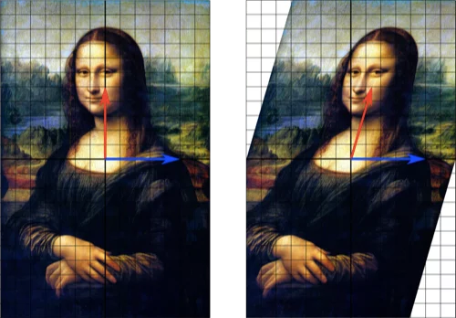

## A Second Course in Linear Algebra

  

---

This is a repo for assignments completed for a second course in Linear Algebra founded on Sheldon Axler's [Linear Algebra Done Right](https://linear.axler.net/).

All assignments are provided as source Latex documents.
*Note that some documents are dependent on images located in .img/.*
